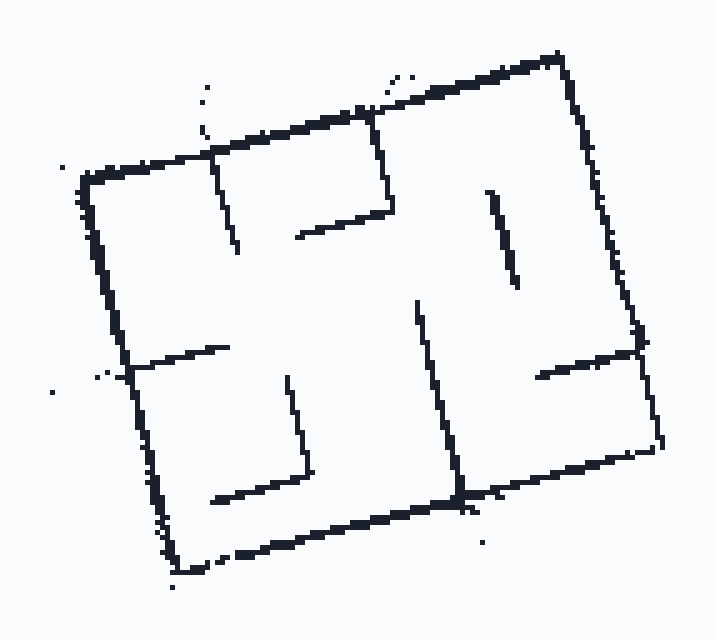
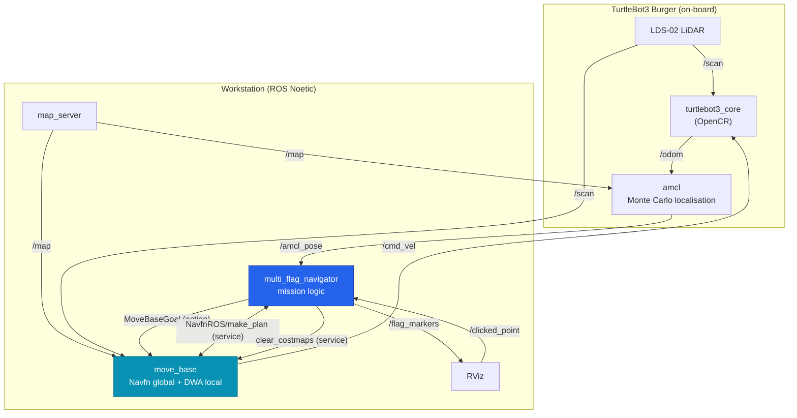

# TurtleBot3 Maze Flag Navigation

Autonomous multi-point navigation for a TurtleBot3 Burger in a physical maze. The robot
receives five goal points at runtime, decides its own visiting order, and drives to each
one without a map of the route being given to it in advance.

<p align="center">
  
  <br>
  <sub>The 7.2 m × 6.4 m campus maze, mapped with gmapping at 5 cm/cell. Corridors are ~0.6 m wide.</sub>
</p>

<p align="center">
  
  
  
  
</p>

---

## The problem

Five flags are placed in a maze. The robot has to reach all of them, and it is told where
they are only once the run has started. Two constraints shape the whole design:

- **Nothing about the maze may be hardcoded.** No waypoint lists, no pre-planned routes.
  Flags arrive at runtime as RViz `Publish Point` clicks and could be anywhere.
- **Order is the robot's choice.** Visiting flags in the order they are given is allowed
  but slow. Choosing a good order is where the actual work is.

Result: **all 5 flags captured in 4 min 42 s, zero collisions**, on physical hardware.
The full write-up, including the hardware debugging photographs, is in the
[capstone report](docs/capstone-report.pdf).

## The interesting part: what "nearest" means in a maze

The obvious way to pick the next flag is straight-line distance. In a maze that is wrong,
and it is wrong in a specific way that costs a lot of time:

```
        wall
   ╭──────┼───────╮
   │  R   │   A   │        A is 1.2 m from the robot in a straight line
   │      │       │        but the only way there is 8 m around the wall.
   │      ╰───╮   │
   │          B   │        B is 3.5 m away in a straight line
   ╰──────────────╯        and 3.6 m to actually drive.
```

Euclidean scoring sends the robot to **A** and wastes the trip. What matters is the length
of a path the robot can actually drive, so the navigator asks the global planner:

```python
plan = self.make_plan(start=robot_pose, goal=flag_pose, tolerance=self.capture_radius)
length = sum(dist(p, q) for p, q in zip(plan.poses, plan.poses[1:]))
```

Each remaining flag is scored by querying `NavfnROS/make_plan` and summing the segment
lengths of the returned path — the same A\* path `move_base` would drive. The robot goes
to the flag that is nearest *to drive to*, not nearest on paper.

Three details make this survive contact with real hardware:

**Plans are validated, not trusted.** An empty plan means unreachable. A plan *shorter*
than the straight-line distance is geometrically impossible, so it indicates a stale
transform or a truncated plan rather than a shortcut — both are rejected.

**Unreachable flags are deprioritised, not dropped.** A flag with no valid plan is scored
`straight_line + 1000`, sorting it behind everything reachable. If a doorway was blocked by
a passing person during scoring, the flag is still attempted later instead of abandoned.

**Costmaps are cleared before every decision.** A stale obstacle inflates path cost and can
make a clear route look unreachable, which silently corrupts the ordering.

Every candidate's score is logged at each decision point, so the chosen order can be
verified against the terminal output after a run rather than taken on trust:

```
--- Selecting next flag (4 remaining) ---
  Flag 2: path 3.61 m (straight 3.48 m)
  Flag 3: path 8.04 m (straight 1.19 m)     <- the trap
  Flag 4: path 5.22 m (straight 4.90 m)
  Flag 5: no plan (straight 6.13 m) -> deprioritised
-> Flag 2 selected (cost 3.61 m)
```

## Architecture



`multi_flag_navigator` is the only custom node. It owns mission logic — which flag is next,
when a flag counts as captured, what to do when the planner gives up — and delegates all
motion to `move_base`. The one exception is recovery, where it publishes to `/cmd_vel`
directly after cancelling the active goal so the two are not fighting for the same topic.

## Running it

**Requires** ROS Noetic on Ubuntu 20.04, a TurtleBot3 Burger, and the `turtlebot3`,
`turtlebot3_msgs`, and `turtlebot3_navigation` packages.

```bash
# 1. Build
cd catkin_ws && catkin_make && source devel/setup.bash

# 2. Point both machines at the same ROS master (bridged networking, not NAT)
export ROS_MASTER_URI=http://<workstation-ip>:11311
export ROS_IP=<this-machine-ip>
export TURTLEBOT3_MODEL=burger

# 3. On the robot
roslaunch turtlebot3_bringup turtlebot3_robot.launch

# 4. On the workstation — map server, AMCL, tuned move_base, navigator and RViz
roslaunch multi_flag_nav multi_flag_nav.launch
```

Then, in RViz:

1. Set the robot's starting pose with **2D Pose Estimate** and let the particle cloud converge.
2. Click five points with the **Publish Point** tool. They appear as red spheres.
3. The mission starts automatically on the fifth click. Captured flags turn green.

Mission parameters are launch arguments — no code edits needed for a different run:

```bash
roslaunch multi_flag_nav multi_flag_nav.launch num_flags:=8 capture_radius:=0.25
```

| Argument | Default | Meaning |
|---|---|---|
| `num_flags` | `5` | Points to collect before the mission starts |
| `capture_radius` | `0.3` | Distance from a flag that counts as reaching it (m) |
| `approach_offset` | `0.1` | Stop-short distance so goals on walls stay in free space (m) |
| `max_retries` | `10` | Recovery attempts before a flag is skipped |
| `map_file` | `maps/b_block_full.yaml` | Occupancy grid to localise against |

## Tuning for 0.6 m corridors

TurtleBot3's stock navigation parameters assume open rooms. In a maze whose corridors are
barely twice the robot's footprint, several defaults actively cause failures. Each change
below fixed an observed one — the full annotated set is in
[`config/move_base_tuning.yaml`](catkin_ws/src/multi_flag_nav/config/move_base_tuning.yaml).

| Parameter | Default | Used | Failure it fixed |
|---|---|---|---|
| `inflation_radius` | 0.20 | **0.65** | Wall-hugging. At 0.65 m the inflation from opposite walls overlaps, making the corridor centre the cheapest route. |
| `cost_scaling_factor` | 3.0 | **1.2** | Deliberately *lowered*. A steep gradient at this inflation radius saturates a narrow corridor at lethal cost, and the global planner reports "no path" through a gap the robot fits. |
| `occdist_scale` | 0.01 | **1.2** | Clipping door frames. Makes clearance dominate the DWA trajectory score. |
| `path_distance_bias` | 32.0 | **8.0** | Balanced against the raised `occdist_scale` to keep the robot on the global path without overriding clearance. |
| `sim_time` | 1.5 | **1.0** | Freezing. Longer rollouts in a tight maze all end in a wall, so every candidate trajectory scores as a collision. |
| `vtheta_samples` | 20 | **48** | Coarse turning near corners. In a corridor the useful decision is which way to turn, not how fast to go. |

The `cost_scaling_factor` line is the counter-intuitive one: raising inflation and
*lowering* the gradient looks backwards, but the two parameters interact. High inflation
with a steep curve means every cell in a narrow corridor exceeds the lethal threshold, and
the planner refuses a route that is physically drivable.

## Engineering problems worth recording

**The robot would not boot.** The Raspberry Pi 4B failed to power on through the OpenCR
board. Tracing the wiring against the TurtleBot3 manual with a multimeter found two
independent faults: the USB Type-A cables for OpenCR and the LiDAR were swapped, and the
power lead was on the wrong GPIO pin. Both had to be right before anything else could be
tested.

**A "dead" LiDAR that was fine.** `/scan` published nothing. The Burger units shipped with
the **LDS-02** sensor, which needs the `ld08_driver` package — the default TurtleBot3 setup
brings up the LDS-01 driver, which silently produces no data against LDS-02 hardware.

**ROS topics that would not cross machines.** Intermittent `Master not found` errors and
high latency came from the development VM using NAT networking, which lets the VM reach the
robot but not the reverse — and ROS needs bidirectional connections for topic negotiation.
Bridged networking put both machines on the same subnet as peers.

**Goals placed on walls froze the robot.** A flag clicked against a wall sits inside the
costmap inflation layer, where every DWA trajectory scores as a collision and the local
planner stops dead. `get_approach_pose()` moves the goal 10 cm back along the line from the
robot, putting it in free space while staying well inside the 0.3 m capture radius — so the
flag still counts as reached.

Capture detection is also independent of `move_base`'s own goal tolerance. The robot
usually passes through the capture zone before the action server reports `SUCCEEDED`, and
there is no reason to keep driving toward a flag that has already been taken.

## Results

| Metric | Result |
|---|---|
| Flags captured | 5 / 5 |
| Mission time | 4 min 42 s |
| Collisions | 0 |
| Oscillation failures | 0 |
| Capture order | F1 → F4 → F2 → F5 → F3 |

The capture order differs from the order the flags were given, which is the point: the
robot reordered them by drivable distance rather than accepting the sequence it was handed.

> **Provenance of these numbers:** the 4:42 run used straight-line flag scoring, which is
> what the robot ran on competition day. The two scoring methods pick the same flag
> whenever no wall stands between the robot and the nearest one, which is why the simpler
> version held up on that layout. `make_plan` path-length scoring was added afterwards to
> remove that dependency on luck; it has not been re-timed on hardware, and the table above
> is not a measurement of it.

## Repository layout

```
catkin_ws/src/multi_flag_nav/
├── scripts/multi_flag_navigator.py   # the entire mission logic
├── launch/multi_flag_nav.launch      # map_server + AMCL + tuned move_base + navigator
├── config/move_base_tuning.yaml      # annotated parameter overrides
├── maps/b_block_full.{pgm,yaml}      # gmapping output, 5 cm/cell
└── worlds/maze.world                 # Gazebo world for simulation
docs/ARCHITECTURE.md                  # node graph, message flow, state machine
docs/capstone-report.pdf              # submitted report, with hardware photographs
```

## What I would do next

**Re-plan in transit.** Flag order is fixed at each decision point. If the costmap updates
mid-drive and a closer flag opens up, the robot should notice rather than finish the leg it
committed to.

**Solve the ordering properly.** Greedy nearest-first is not optimal — this is a small
travelling salesman problem, and with only five flags an exact solution over the pairwise
`make_plan` distance matrix is cheap. Greedy was the right call under competition time
pressure; it is not the right answer.

**Cartographer instead of gmapping.** The corridors are featureless enough that scan
matching struggles, which is the underlying reason localisation needed slow velocities.

## Team

Built by team **Donatello** for Capstone Design (202601-ICE/CSE4020), Inha University in Tashkent.

| Member | Role |
|---|---|
| **Sarvar Islamov** (U2210088) | Team lead — coordination, parameter tuning, requirement compliance |
| Fuzaylkhon Abdurakhimov (U2210013) | Systems admin — bridged networking, LDS-02 driver |
| Gayday Aleksey (U2210077) | Reliability — approach-offset and costmap-clearing recovery |
| Inomjonov Javohirbek (U2210086) | Algorithms — flag selection and distance calculation |
| Kalimullin Rinat (U2210099) | HMI — RViz interactive flag selection and markers |
| Shovkatjon Komilov (U2210122) | Architecture — ROS node integration |
| Javohirbek Xatamov (U2210251) | Hardware — assembly analysis, OpenCR wiring diagnosis |

Code was shared during development and consolidated on the team lead's machine, so the
upstream commit history does not reflect individual contributions.

## License

MIT — see [LICENSE](LICENSE).
