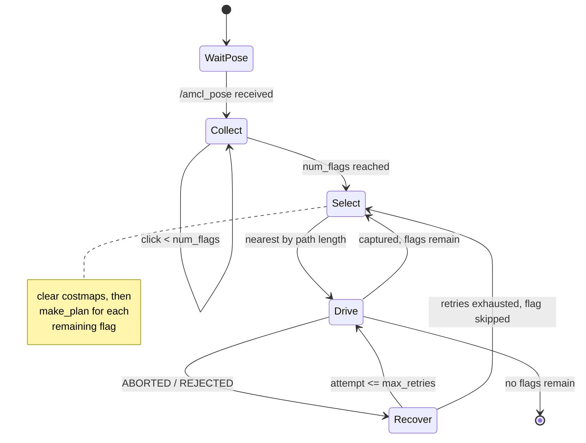

# Architecture

Design notes for `multi_flag_nav`. The [README](../README.md) covers what the system does
and how to run it; this covers how it is put together and why.

## Division of responsibility

One custom node, `multi_flag_navigator`, sits on top of an otherwise stock ROS Navigation
Stack. The split is deliberate:

| Concern | Owner |
|---|---|
| Where am I? | `amcl` |
| Is there a path from here to there, and how long is it? | `move_base` / Navfn |
| How do I drive that path without hitting anything? | `move_base` / DWA |
| **Which flag next, and when does a flag count as taken?** | **`multi_flag_navigator`** |
| **What to do when the planner gives up** | **`multi_flag_navigator`** |

Everything in the top half is a solved problem with a well-tested implementation. The
custom node stays small and owns only mission-level decisions, which is also what makes the
flag-selection logic straightforward to test in isolation.

## Interfaces

**Subscribes**

| Topic | Type | Purpose |
|---|---|---|
| `/amcl_pose` | `PoseWithCovarianceStamped` | Current robot position for scoring and capture checks |
| `/clicked_point` | `PointStamped` | Flag positions from the RViz **Publish Point** tool |

**Publishes**

| Topic | Type | Purpose |
|---|---|---|
| `/flag_markers` | `MarkerArray` | Flag spheres and labels, red pending / green captured. Latched, so RViz opened mid-run still shows state |
| `/cmd_vel` | `Twist` | Recovery manoeuvres only, and only after the active goal is cancelled |

**Calls**

| Interface | Type | Purpose |
|---|---|---|
| `move_base` | action | Goal dispatch and status |
| `/move_base/NavfnROS/make_plan` | service | Path length to a candidate flag |
| `/move_base/clear_costmaps` | service | Drop stale obstacles before scoring and during recovery |

## Mission state machine

`WaitPose` matters more than it looks. Scoring flags before AMCL has published a pose would
measure from a garbage position and fix a bad visiting order for the whole run.

## Flag selection

At each decision point:

1. **Clear costmaps.** A stale obstacle inflates path cost and can make a clear flag look
   unreachable — a silent corruption of the ordering, not a visible failure.
2. **Score every remaining flag** with `make_plan` from the current pose, summing segment
   lengths of the returned path.
3. **Validate each plan.** Reject empty plans (unreachable) and plans shorter than the
   straight-line distance (geometrically impossible, so a stale transform or truncated
   plan rather than a shortcut).
4. **Deprioritise rather than drop.** A flag with no valid plan scores
   `straight_line + 1000`, sorting behind everything reachable but still attempted once
   the reachable flags are done. A doorway blocked by a passing person should not
   permanently disqualify a flag.
5. **Log every candidate** so the order can be checked against terminal output afterwards.

If `NavfnROS/make_plan` is unavailable — a different global planner, or move_base not fully
up — the node logs a warning and falls back to straight-line scoring rather than failing.

## Reaching a flag

Two mechanisms, because `move_base`'s own goal handling is not sufficient on its own.

**Approach offset.** A flag clicked against a wall sits inside the inflation layer. Every
DWA trajectory there scores as a collision, so the local planner stops and never recovers.
`get_approach_pose()` moves the goal `approach_offset` (0.1 m) back along the line from the
robot to the flag, which lands in free space while staying well inside the 0.3 m capture
radius. The goal the robot is given and the flag it is scored against are different points
on purpose.

**Independent capture detection.** `is_captured()` checks Euclidean distance to the *flag*,
not the approach pose, on every poll. The robot typically enters the capture zone before
the action server reports `SUCCEEDED`; continuing to drive after that wastes time and risks
a wall. Whichever fires first ends the leg.

This is why `approach_offset < capture_radius` is a hard requirement. If the offset were
larger, the robot could satisfy `move_base` at a pose that is still outside the capture
zone. The node warns at startup if the two are configured that way.

## Recovery

`move_base` has its own recovery behaviours; these run when those have already failed and
the goal comes back `ABORTED` or `REJECTED`. Escalating, per goal:

| Attempt | Action | Rationale |
|---|---|---|
| 1 | Clear costmaps, rotate in place 2.5 s | Usually a phantom obstacle. Cheapest fix, no motion risk |
| 2 | Reverse 1.5 s, rotate opposite direction | Physically backing out of a corner |
| 3+ | Reverse 2.5 s, rotate harder 3 s, clear again | Genuinely wedged |

After `max_retries` the flag is skipped and the mission continues. Four flags is a better
outcome than a robot stuck on the fifth until the clock runs out.

The active goal is cancelled before any of these run. Without that, `move_base` and the
navigator both publish to `/cmd_vel` and the robot receives interleaved commands from two
controllers with different intentions.

## Known limitations

**Ordering is greedy.** Nearest-first is not optimal. With five flags, an exact TSP
solution over the pairwise `make_plan` distance matrix is cheap and would be strictly
better.

**No re-planning in transit.** Once a flag is selected the robot commits to it. A costmap
update mid-drive that opens a shorter route to a different flag is not noticed.

**Recovery is open-loop.** The reverse manoeuvres drive for a fixed duration without
checking `/scan`. Reversing into an obstacle behind the robot is possible; it did not occur
in testing because the failure mode that triggers recovery is almost always a *forward*
obstruction, but the assumption is not enforced.

**Capture is position-only.** Reaching a flag means being within 0.3 m of it. Final heading
is unconstrained, which is correct for this task and would not be for docking.
